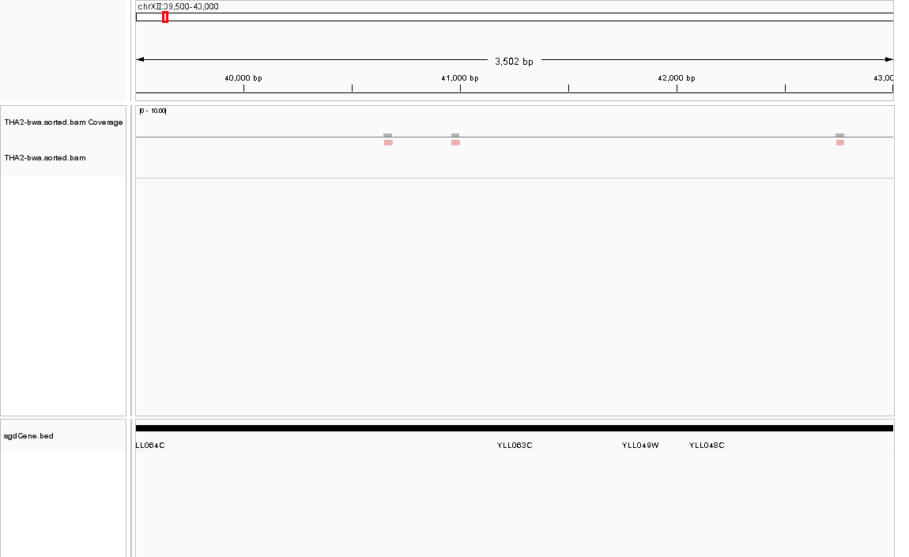
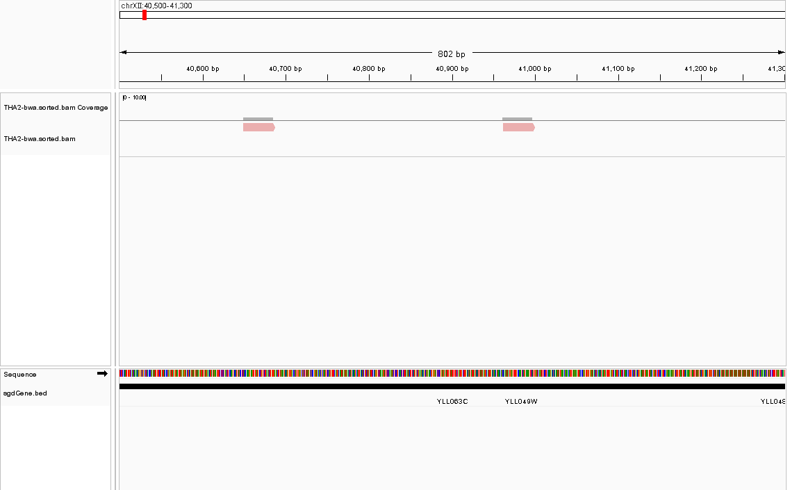

# Mapping Homework

**Author:** 鲁奥晗  
**Student ID:** 2023012411

## (1) Bowtie中BWT的性质与内存优化策略

### BWT的性质提高运算速度
Bowtie的核心在于利用了Burrows-Wheeler Transform (BWT) 结合FM-index结构，从而实现了极高的比对速度。其速度提升主要依赖于以下两个关键性质：
1. **LF-mapping（Last-to-First mapping）性质**：在BWT矩阵中，最后一列（L列）中某字符的第$i$次出现，与第一列（F列）中该字符的第$i$次出现，对应于原始基因组序列中的同一个物理位置。这一性质使得在不还原原始序列的情况下，可以在BWT字符串上进行精确的游走。
2. **Backward Search（逆向搜索）算法**：基于LF-mapping，Bowtie允许从待比对序列（read）的最后一个字符开始，从右向左逐个字符进行精确匹配。在每一步匹配中，算法通过查询预先计算好的Occ表（Occurrence Array）和C表（Count Array），可以在$O(1)$时间内确定前缀在后缀数组（Suffix Array, SA）中的区间范围$[lo, hi]$。因此，精确匹配一个长度为$m$的read的时间复杂度仅为$O(m)$，完全独立于庞大的参考基因组大小（如人类基因组的30亿碱基），从而实现了数量级上的速度飞跃。

### 内存优化策略
为了在普通商用计算机（如内存仅有2-4GB的PC）上运行人类基因组级别的比对，Bowtie采用了基于FM-index的极致内存优化策略：
1. **Occ表（Occurrence Array）检查点采样（Checkpointing）**：完整存储Occ表（记录每个字符在L列前$i$个位置的出现次数）需要消耗巨大的内存（$m \times |\Sigma|$ 个整数）。Bowtie通过仅在每隔一定行数（如每32行或128行）存储一个检查点来压缩内存。查询非检查点行时，只需从最近的检查点出发，扫描L列中相邻的几个字符即可计算出结果。这是一种典型的时间换空间策略，在查询时间略微增加（常数级别）的情况下大幅降低了内存占用。
2. **后缀数组（Suffix Array, SA）等距采样**：完整的后缀数组需要为基因组的每个位置存储一个32位或64位指针，对于人类基因组需要十几GB内存。Bowtie对SA进行等距采样（例如每隔32个位置存储一个值）。当比对完成后需要将BWT索引位置转换为基因组实际坐标时，如果当前位置未被采样，算法会利用LF-mapping在BWT中不断向前回溯，直到遇到一个被采样的位置，再加上回溯的步数即可精确计算出实际坐标。
3. **双位编码与BWT的天然可压缩性**：DNA序列仅包含A、C、G、T四种碱基，Bowtie使用2-bit编码来表示每个碱基。更重要的是，BWT转换会根据字符的右上下文进行排序，导致相同字符在L列中大量聚集（形成长串的连续相同字符）。Bowtie利用这一特性，采用游程编码（Run-Length Encoding）等压缩算法对L列进行高度压缩，使得整个人类基因组的索引大小仅约1.3 GB。

## (2) Bowtie Mapping与各染色体Reads统计

```bash
# 执行Bowtie mapping
bowtie -v 2 -m 10 --best --strata BowtieIndex/YeastGenome -f THA2.fa -S THA2.sam

# 统计mapping到不同染色体上的reads数量
samtools view -F 4 THA2.sam | awk '{print $3}' | sort | uniq -c | sort -rn
```

```text
    194 Scchr04
    169 Scchr12
    125 Scchr07
    101 Scchr15
     78 Scchr16
     71 Scchr10
     68 Scchr08
     67 Scchr13
     58 Scchr14
     56 Scchr11
     51 Scchr02
     33 Scchr05
     25 Scchr09
     18 Scchr01
     17 Scchr06
     15 Scchr03
     12 Scmito
```

## (3) SAM/BAM文件格式问题

### (3.1) CIGAR string的含义与信息
CIGAR (Compact Idiosyncratic Gapped Alignment Report) string 是SAM/BAM文件中用于描述read与参考基因组比对详细拓扑结构的字符串。它由数字和字母（操作符）交替组成，例如`36M`、`10M2I24M`等。数字代表碱基的数量，字母代表比对的状态。
它包含了read在比对区域内的碱基级别结构信息：
- **M (Alignment match)**：序列匹配或错配（注意：M不代表100% identical，错配也记为M，具体错配信息需结合MD标签或NM标签查看）。
- **I (Insertion)**：相对于参考基因组，read中发生了插入。
- **D (Deletion)**：相对于参考基因组，read中发生了缺失。
- **N (Skipped region)**：通常用于RNA-seq数据，表示跨越内含子的剪接区域。
- **S (Soft clipping)** 和 **H (Hard clipping)**：表示序列被剪切。

### (3.2) Soft clip的含义与表示
"Soft clip"（软剪切）表示read的某一部分序列未能与参考基因组成功比对，但这段未比对上的序列仍然被完整保留在SAM/BAM文件的SEQ（序列）和QUAL（质量值）字段中。这通常发生在read的边缘，生物学或实验原因可能包括：测序接头（Adapter）污染未切干净、低质量碱基导致的局部比对失败、或者是由于结构变异（SV，如大片段插入、易位）和嵌合转录本导致的断点。
在CIGAR string中，soft clip用字母**S**表示。例如，`5S31M`表示read的前5个碱基被软剪切（未比对上但保留在记录中），随后的31个碱基成功比对到参考基因组。

### (3.3) Mapping quality的含义与信息
Mapping quality（MAPQ，比对质量值）是一个数值（通常为0-255），反映了比对软件对该read比对到参考基因组特定位置的统计学置信度。它在数学上定义为 $-10 \times \log_{10}(P)$，其中$P$是该比对位置是错误的概率。例如，MAPQ=30意味着比对错误的概率为0.001（即99.9%的准确率）。
MAPQ值综合反映了以下信息：
1. **唯一性（Uniqueness）**：如果一个read能以相似的得分比对到基因组的多个重复区域（多重比对，Multi-mapping），软件无法确定其真实来源，其MAPQ值通常会被设为0或极低值。
2. **错配与Gap数量**：比对中包含的错配（mismatch）或印记（indel）越多，MAPQ越低。
3. **测序质量**：发生错配位置的碱基测序质量（Phred score）越低，对MAPQ的惩罚越小；反之，高质量碱基的错配会严重降低MAPQ。

### (3.4) 仅根据SAM/BAM推断参考基因组序列
仅根据SAM/BAM文件中的信息不能完全推断出read mapping到的区域对应的参考基因组序列。
原因如下：
1. **缺失（Deletion, D）信息不足**：对于参考基因组中发生缺失的区域，SAM文件的CIGAR只记录了缺失的长度（如`5D`），而不包含这5个缺失碱基的具体序列内容。
2. **插入（Insertion, I）的盲区**：对于read中发生插入的区域，参考基因组在对应位置是没有碱基的，这部分序列属于read特有。
3. **未覆盖区域**：SAM/BAM只包含有reads覆盖的区域信息，对于没有任何reads比对上的基因组区域（如着丝粒、高度重复序列或测序深度不足的区域），完全无法推断其序列。
因此，要获得完整的参考基因组序列，必须依赖原始的FASTA参考文件。SAM/BAM文件本质上是相对于参考基因组的"差异记录"（Delta encoding），而非完整序列的容器。

## (4) BWA安装与Yeast基因组Mapping

```bash
# 安装BWA
sudo apt-get install -y bwa

# 对Yeast基因组建立索引
bwa index sacCer3.fa

# 使用BWA将THA2.fa比对到Yeast参考基因组
# 由于THA2.fa包含较短的reads，使用bwa aln/samse流程
bwa aln sacCer3.fa THA2.fa > THA2-bwa.sai
bwa samse sacCer3.fa THA2-bwa.sai THA2.fa > THA2-bwa.sam

# 统计BWA mapping结果
samtools view -F 4 THA2-bwa.sam | awk '{print $3}' | sort | uniq -c | sort -rn
```

```text
    202 chrIV
    178 chrXII
    129 chrVII
    108 chrXV
     83 chrXVI
     77 chrX
     72 chrXIII
     70 chrVIII
     60 chrXI
     59 chrXIV
     54 chrII
     38 chrV
     26 chrIX
     18 chrVI
     18 chrM
     17 chrIII
     17 chrI
```

## (5) Genome Browser 可视化展示

为了直观展示 mapping 结果，我们将 BWA 生成的 SAM 文件转换为排序并建索引的 BAM 文件，并使用 **IGV (Integrative Genomics Viewer)** 对酵母基因组（sacCer3）的特定区域进行了可视化。

### 5.1 数据预处理

```bash
# 将 SAM 转换为 BAM，并进行排序和建索引
samtools view -bS THA2-bwa.sam | samtools sort -o THA2-bwa.sorted.bam
samtools index THA2-bwa.sorted.bam

# 下载酵母基因组注释文件并转换为 BED 格式供 IGV 使用
curl -s "https://hgdownload.soe.ucsc.edu/goldenPath/sacCer3/database/sgdGene.txt.gz" -o sgdGene.txt.gz
gunzip -f sgdGene.txt.gz
awk 'BEGIN{OFS="\t"} {print $3, $5, $6, $2, 0, $4, $7, $8, 0, $9, $10, $11}' sgdGene.txt > sgdGene.bed
```

### 5.2 基因区域可视化截图

根据 `samtools depth` 统计，我们在 `chrXII` 染色体上找到了 reads 相对集中的区域，并定位到 **YLL049W** 基因。以下是该区域的 IGV 可视化截图。

**图 1：YLL049W 基因区域总览 (chrXII:39,500-43,000)**
展示了该区域的基因结构（底部黑色粗线为外显子，细线为内含子/UTR）以及 reads 的整体覆盖情况。



**图 2：Reads 详细比对情况 (chrXII:40,500-41,300)**
放大视图展示了单条 reads 的比对细节。图中 reads 按照比对链（Read Strand）着色，粉红色/红色表示比对到正链（Forward strand）。底部轨道展示了参考基因组的碱基序列（Sequence）和氨基酸翻译。


